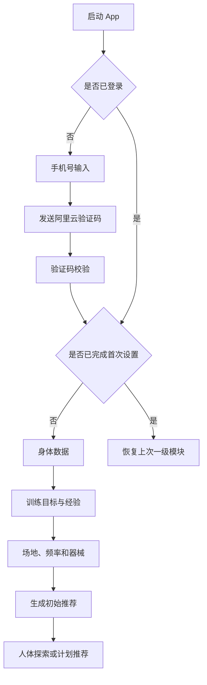
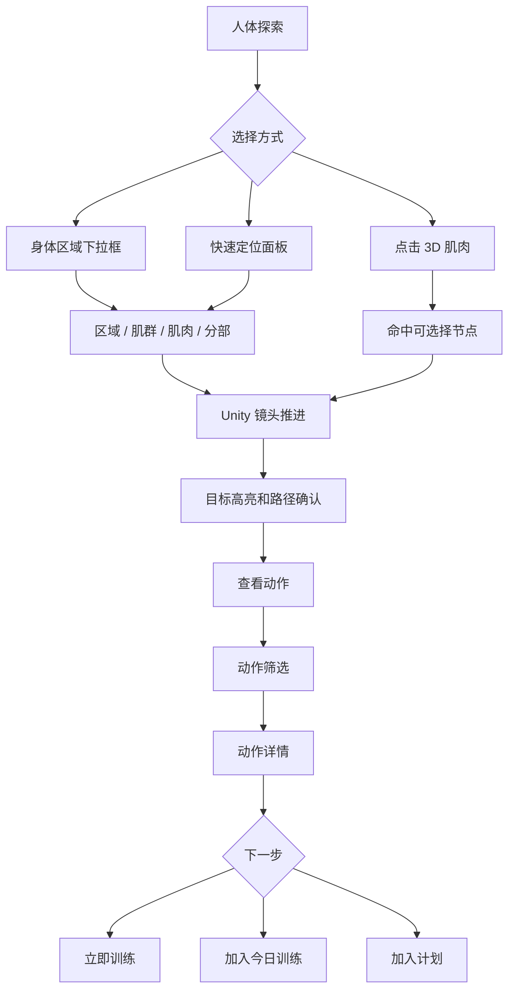
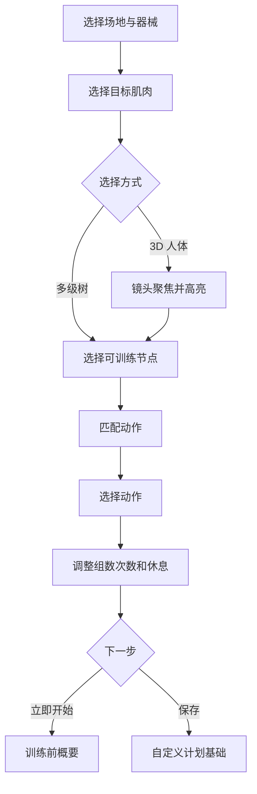
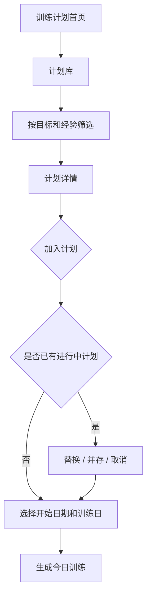
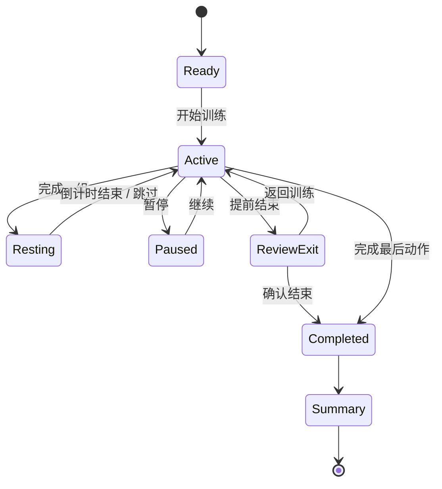
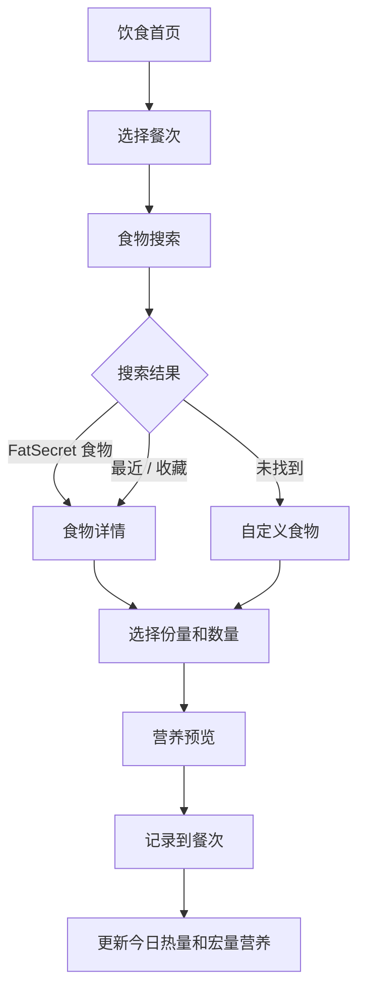

# YOU GYM 信息架构与用户流程

版本：1.0  
更新日期：2026-08-14  
依赖文档：`../design.md`、`../YOU_GYM_产品需求文档_v1.0.md`

## 1. 全局信息架构

```text
App
├── 启动与认证
│   ├── 启动检查
│   ├── 手机号登录 / 注册
│   ├── 验证码
│   ├── 用户协议与隐私政策
│   └── 首次设置
│       ├── 基础身体数据
│       ├── 训练目标
│       ├── 训练经验
│       ├── 每周频率
│       ├── 常用场地
│       └── 可用器械
├── 人体
│   ├── 3D 人体探索
│   ├── 身体区域下拉导航
│   ├── 解剖树选择
│   ├── 快速定位
│   ├── 模型设置
│   ├── 肌肉聚焦
│   ├── 动作筛选
│   └── 动作详情
├── 训练计划
│   ├── 今日训练
│   ├── 我的计划
│   ├── 计划库
│   ├── 计划详情
│   ├── 计划日详情
│   ├── 计划编辑
│   ├── 训练执行
│   ├── 休息计时
│   ├── 动作替换
│   ├── 训练总结
│   ├── 历史记录
│   └── 趋势与个人纪录
├── 饮食管理
│   ├── 今日营养
│   ├── 餐次列表
│   ├── 食物搜索
│   ├── 食物详情与份量
│   ├── 最近 / 收藏
│   ├── 自定义食物
│   ├── 记录详情
│   └── 饮食历史
└── 个人
    ├── 个人首页
    ├── 身体数据
    ├── 训练目标与经验
    ├── 提醒设置
    ├── 通知中心
    ├── 下载与缓存
    ├── 隐私与账号
    ├── 帮助与反馈
    └── 关于
```

## 2. 一级导航规则

一级导航固定为四项：

```text
人体 | 训练计划 | 饮食管理 | 个人
```

- 使用底部胶囊导航，视觉参数遵循 `design.md`。
- 一级导航只出现在各模块根页面和可安全切换的二级页面。
- 训练执行、验证码、首次设置、动作视频全屏播放等沉浸任务隐藏一级导航。
- 再次点击当前一级导航项时，返回该模块根页面并滚动到顶部。
- 切换一级模块时保留未提交的训练记录；如果存在不可丢失编辑，先保存草稿。
- Android 系统返回键优先关闭浮层，再返回上一页面，最后才退出 App。

## 3. 页面层级

### 3.1 L0：系统与认证

不显示一级导航。包括启动、登录、验证码、协议、首次设置和强制更新。

### 3.2 L1：一级模块根页面

显示一级导航：人体探索、训练计划首页、饮食首页、个人首页。

### 3.3 L2：模块任务页面

根据任务决定是否显示一级导航。动作筛选、历史和设置可保留；计划详情、食物搜索可隐藏以增加内容空间。

### 3.4 L3：沉浸执行页面

隐藏一级导航。包括训练执行、休息计时全屏态、动作视频播放、3D 专注查看和不可中断的首次设置步骤。

## 4. 新用户旅程



### 4.1 首次设置退出

- 每完成一步立即保存草稿。
- 用户退出后，下次从未完成步骤继续。
- 除手机号、协议同意外，允许“稍后设置”的字段必须明确标注影响。
- 没有身高或体重时不生成精确热量目标，只显示待完善状态。

## 5. 人体选肌流程



### 5.1 选择非训练节点

- 肌腱、韧带、起止点等展示节点可以被查看。
- 信息面板说明该结构作用和“不可直接作为训练筛选目标”的原因。
- “查看动作”按钮替换为“查看相关肌肉”，进入关联肌肉列表。

### 5.2 连续选择

- 新选择发生时取消未完成镜头动画。
- 动作筛选面板已打开时，选择新肌肉先关闭面板再更新。
- 当前筛选条件是否保留由语义决定：场地和器械保留，目标肌肉自动替换。

## 6. 动作发现流程

```text
肌肉目标
  ↓
动作筛选：场地 / 器械 / 难度 / 目标 / 动作模式
  ↓
推荐排序：匹配度 → 安全性 → 用户水平 → 器械可用性
  ↓
动作详情
  ├── 观看示范
  ├── 查看步骤和错误
  ├── 立即训练
  ├── 加入今日训练
  └── 加入指定计划
```

无结果时：

1. 保留当前肌肉目标。
2. 明确指出导致无结果的筛选项。
3. 提供“放宽器械”“降低难度”或“查看相邻肌肉动作”。
4. 不展示与目标完全无关的热门动作填充页面。

### 6.1 快速训练生成流程

快速训练生成器从计划首页、人体快速定位或动作筛选进入，借鉴 Workout.cool 的分步任务方式，但共用 YOU GYM 的 3D 人体、动作筛选和专业审核数据。



- 返回上一步保留已选条件。
- 从 3D 人体返回生成器时恢复到 QWK-02，并带回完整解剖路径。
- 三步/五步只是界面组织方式，服务端仍使用统一动作筛选接口。
- 无结果时指出冲突条件，不能静默加入不匹配动作。

## 7. 训练计划发现与加入



### 7.1 替换计划

- 明确展示原计划剩余周期和新计划开始时间。
- 历史记录不删除。
- 尚未完成的未来日程可以取消或归档。

## 8. 今日训练流程



### 8.1 训练执行顺序

1. 查看今日训练概要。
2. 开始训练总计时。
3. 查看当前动作媒体和提示。
4. 输入或确认重量、次数、时间和 RPE。
5. 完成当前组，进入休息计时。
6. 跳过、延长或完成休息。
7. 完成所有组后进入下一动作。
8. 可替换动作，保留目标肌肉和器械条件。
9. 完成训练后生成总结。

### 8.2 中断和恢复

- App 进入后台时保存会话状态和真实时间戳。
- 被系统杀死后再次打开，提示恢复未完成训练。
- 用户主动放弃时保留已完成组，可选择保存为未完成记录或删除本次会话。
- 网络不可用时本地继续记录，恢复网络后同步。

## 9. 自定义计划流程

```text
新建计划
  ↓
名称、目标、经验、周期、每周频率
  ↓
添加训练日
  ↓
从人体、动作库或已有计划添加动作
  ↓
配置组数、次数、重量建议、休息
  ↓
添加热身、拉伸和风险提示
  ↓
预览周安排
  ↓
保存草稿 / 启用计划
```

验证规则：

- 至少包含一个训练日和一个动作。
- 同一训练日预计时长超过 120 分钟时提示。
- 连续高强度训练相同主要肌群时提示恢复风险。
- 删除训练日或动作前说明影响。

## 10. 饮食记录流程



### 10.1 修改和删除记录

- 从餐次列表进入记录详情。
- 修改份量后实时预览营养变化。
- 删除使用二次确认，说明将影响当日统计。
- 离线创建的自定义记录标记为待同步，不阻止继续记录。

## 11. 提醒与通知流程

### 11.1 训练提醒

```text
计划生成训练日
  ↓
用户开启训练提醒
  ↓
选择时间和重复规则
  ↓
请求系统通知权限
  ↓
本地通知 / App Push
  ↓
点击通知进入今日训练
```

### 11.2 短信

阿里云短信只用于：

- 登录或注册验证码。
- 更换手机号和账号找回。
- 账号安全风险。
- 法律、服务中断等极少数重要通知。

普通训练、饮食和计划提醒不得走短信。

## 12. 权限流程

| 权限 | 请求时机 | 拒绝后的处理 |
| --- | --- | --- |
| 通知 | 用户首次开启提醒时 | 保留 App 内提醒设置，展示前往系统设置入口 |
| 相册 | 用户选择头像或上传自定义食物图片时 | 允许继续使用默认头像或无图记录 |
| 相机 | 首版仅在明确启用拍照上传时请求 | 不影响核心训练和饮食流程 |
| 网络 | 系统能力，不单独请求 | 基础模型、缓存计划和离线记录继续可用 |

## 13. 导航和返回规则

- 点击返回先关闭当前键盘、菜单、对话框或底部面板。
- 从动作详情返回动作筛选时保留全部筛选条件和滚动位置。
- 从动作筛选返回人体时保留最后选中的肌肉和镜头状态。
- 从训练执行返回需要确认，防止误触丢失记录。
- 从食物详情返回搜索结果时保留搜索词和餐次。
- 一级导航切换不清空未提交草稿。

## 14. 深链接目标

预留以下深链接：

```text
yougym://anatomy/{nodeId}
yougym://exercise/{exerciseId}
yougym://plan/{planId}
yougym://workout/today
yougym://nutrition/today
yougym://notification/{messageId}
```

- 未登录时先完成登录，再恢复目标页面。
- 内容已下线时展示不可用说明和替代入口。
- 深链接不得绕过协议、权限或安全检查。

## 15. 全局状态模型

每个数据型页面至少设计以下状态：

| 状态 | 视觉要求 | 操作 |
| --- | --- | --- |
| 初始加载 | 结构化骨架屏 | 无 |
| 刷新 | 保留已有内容，显示局部进度 | 可继续浏览 |
| 空数据 | 说明原因和下一步 | 明确主操作 |
| 网络错误 | 保留可用缓存 | 重试、离线继续 |
| 权限受限 | 说明权限用途 | 前往设置、稍后 |
| 服务错误 | 简洁错误说明 | 重试、反馈 |
| 部分成功 | 显示已完成和失败部分 | 重试失败项 |
