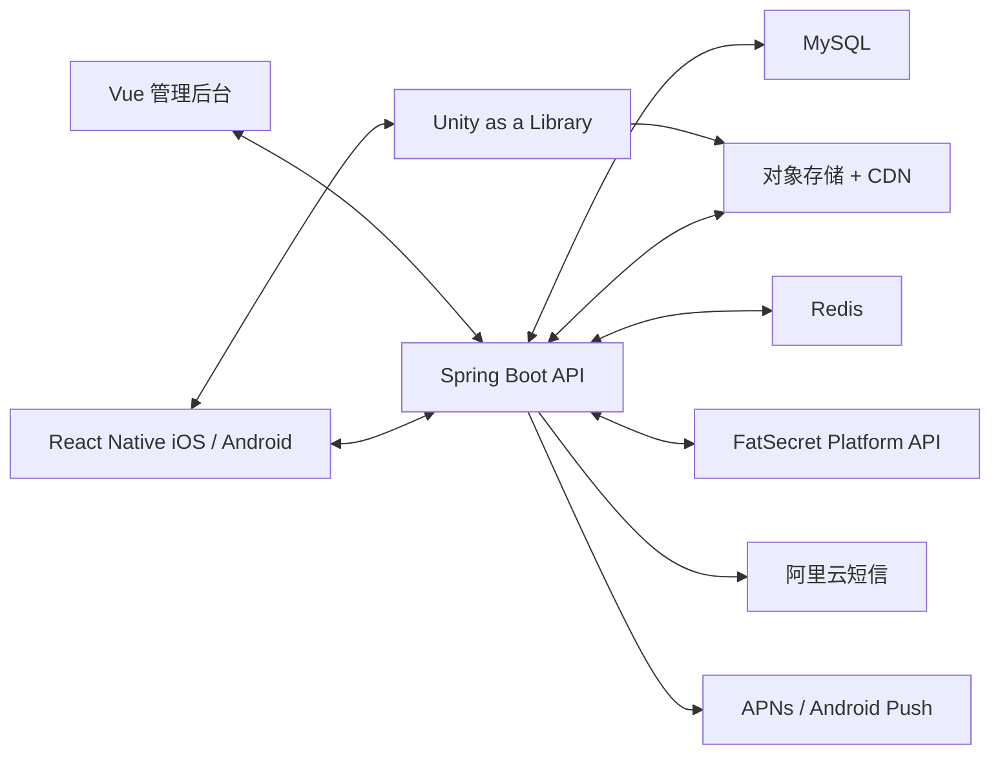

# YOU GYM 技术架构与资源方案

版本：1.0  
更新日期：2026-08-14

## 1. 技术目标

架构必须支撑 React Native 双端应用、Unity 高精度人体、离线训练记录、FatSecret 食品适配、大体积媒体与模型分发、Vue 管理后台和可审计内容发布。首版优先稳定、可恢复和可观察，不引入无必要的微服务拆分。

## 2. 总体架构



首版后端采用模块化单体：认证、用户、解剖、动作、计划、训练、饮食、通知、资源、后台与审计在一个 Spring Boot 部署单元中保持清晰包边界。业务规模证明需要后再拆分。

## 3. React Native 客户端

### 3.1 模块边界

- `auth`：手机号认证、token、协议。
- `anatomy`：人体模块宿主、Unity Bridge、动作筛选。
- `exercise`：动作列表、详情、媒体缓存。
- `training`：计划、训练会话、计时、历史和趋势。
- `nutrition`：食品搜索、份量、餐次、目标。
- `profile`：资料、提醒、下载、隐私。
- `core`：网络、缓存、日志、分析、远程配置和设计 token。

使用 TypeScript 严格模式。服务端数据经 schema 验证后进入业务层；数值单位内部统一为公制和秒，展示层负责转换。

### 3.2 本地持久化

训练执行、饮食记录队列、下载清单和最近动作使用本地数据库；token 使用系统安全存储。关键训练组在每次编辑后立即落盘，不等待页面退出。缓存按内容版本和用户 ID 隔离。

### 3.3 导航

根导航：认证栈 → 首次设置栈 → 四个 Tab（人体、训练、饮食、个人）。Unity 视图只挂载在人体 Tab；离开时暂停渲染而非频繁销毁。全屏视频和训练执行使用模态/独立栈，返回行为需要可预测。

## 4. Unity as a Library

### 4.1 集成原则

- Unity 负责模型加载、解剖节点拾取、材质高亮、镜头动画和渲染。
- React Native 负责导航、列表、底部面板、下载状态和业务 API。
- 两侧只通过版本化 JSON 消息通信，禁止共享隐式全局状态。
- Unity 场景没有业务登录逻辑，不直接请求用户数据。

### 4.2 Bridge 消息

RN → Unity：

```json
{
  "version": 1,
  "requestId": "uuid",
  "type": "FOCUS_ANATOMY_NODE",
  "payload": {
    "nodeId": "muscle.deltoid.anterior.left",
    "gender": "female",
    "cameraPreset": "shoulder_close"
  }
}
```

Unity → RN：

```json
{
  "version": 1,
  "requestId": "uuid",
  "type": "ANATOMY_NODE_SELECTED",
  "payload": {
    "nodeId": "muscle.deltoid.anterior.left",
    "screenAnchor": {"x": 0.62, "y": 0.31},
    "selectableForTraining": true
  }
}
```

消息必须包含版本、类型和 `requestId`；未知类型忽略并记录。选择事件 200ms 内回传，重复点击相同节点应幂等。

### 4.3 生命周期

- App 进入后台：暂停渲染和动画，保留当前节点、性别、镜头和已加载包状态。
- 内存告警：卸载非当前性别高精度包和远端纹理；基础低精度模型始终保留。
- 返回人体页：先显示最后帧占位，再恢复 Unity，避免黑屏闪烁。
- Unity 崩溃或初始化失败：React Native 显示可重试错误页和 2D 区域列表降级入口。

## 5. 模型、媒体与资源分发

### 5.1 安装包策略

随 App 发布：男性/女性基础低精度模型、最低分辨率纹理、核心动画、最小解剖映射表、错误降级图。高精度表层肌、深层肌、起止点、肌腱/韧带、高清纹理和动作媒体通过对象存储 + CDN 远程下载。

### 5.2 资源包

| 包 | 内容 | 建议触发 |
| --- | --- | --- |
| `base-male` / `base-female` | 低精度全身、基础区域 | 安装包内 |
| `surface-muscle-*` | 表层肌肉和肌束 | 首次选择性别时 |
| `deep-muscle-*` | 深层肌肉 | 用户主动开启深层 |
| `attachment-*` | 起止点、肌腱、韧带 | 用户主动查看 |
| `exercise-media-*` | 动作图和短视频 | 进入动作详情或预下载 |

资源清单包含版本、依赖、大小、SHA-256、最低 App 版本、CDN URL 和回滚版本。下载到临时文件后校验哈希，再原子切换到正式目录。

### 5.3 缓存与清理

默认按 LRU 清理动作媒体；当前使用的模型包、今日计划媒体和进行中训练不可自动删除。PRO-06 显示总占用、分包占用和删除影响。移动网络下载大包前需用户同意。

## 6. Spring Boot 服务端

### 6.1 分层

- Controller：参数、认证上下文、响应协议。
- Application Service：用例和事务边界。
- Domain：状态与业务规则。
- Repository：MySQL/Redis/外部适配。
- Integration：FatSecret、阿里云短信、对象存储和 Push。

禁止在 Controller 直接调用供应商 SDK。外部供应商字段经 adapter 转换为项目内部模型。

### 6.2 MySQL 与 Redis

MySQL 保存主业务数据、历史快照、审核状态和审计日志。Redis 用于验证码频控、短期 token 黑名单、热点食品搜索缓存、资源清单缓存和分布式幂等键；Redis 不作为唯一持久化来源。

### 6.3 异步任务

适合异步：资源转码、食品同步、数据导出、账号延迟删除、Push 批次、趋势聚合。首版可使用可靠数据库任务表 + 定时 worker；任务量增长后再引入消息队列。任务必须具备重试次数、退避、死信状态和可观测 ID。

## 7. 外部集成

### 7.1 FatSecret

服务端适配 OAuth/密钥、限流、重试和缓存；查询超时不超过客户端整体请求预算。供应商不可用时返回最近缓存并标记 `stale=true`，绝不伪造营养数据。

### 7.2 阿里云短信

仅验证码、账号安全和重要系统通知。调用经过频控、模板白名单、签名白名单和审计。普通训练/饮食提醒接口在代码层不能选择 SMS 通道。

### 7.3 Push

iOS 使用 APNs；Android 按目标市场选择合规推送服务并通过统一 Provider 接口封装。设备 token 可轮换、注销时解绑，发送日志不包含健康详情。

## 8. 安全

- 全链路 TLS，服务端机密放入密钥管理服务或环境密钥，不进入仓库。
- 密码学随机数生成验证码；日志中手机号只显示后四位。
- API 使用短期 access token、refresh token 轮换和设备级吊销。
- 管理后台强制 MFA、RBAC、IP/风险策略和审计。
- 上传媒体校验 MIME、扩展名、尺寸、时长和病毒；对象默认私有，通过签名 URL 访问。
- 防止越权：任何 `/me` 数据以 token userId 为准，不接受客户端 userId 覆盖。

## 9. 性能预算

| 项目 | 目标 |
| --- | --- |
| 冷启动到可交互 | 中端设备 ≤ 3 秒（不含首次资源下载） |
| 普通 API P95 | ≤ 500ms（外部搜索除外） |
| 食品搜索 P95 | ≤ 1.5 秒 |
| Unity 首次基础模型显示 | ≤ 3 秒 |
| 已缓存 Unity 恢复 | ≤ 800ms |
| 肌肉选择反馈 | ≤ 100ms，完整聚焦动画约 600ms |
| 训练组本地保存 | ≤ 100ms |
| 崩溃自由会话 | ≥ 99.5% |

3D 目标为主流中端设备 45–60 FPS，低端降级到 30 FPS；内存水位和包大小在真机上设定最终阈值。

## 10. 环境与发布

环境：local、dev、staging、production。不同环境使用独立数据库、对象存储路径、短信模板和 FatSecret 凭证。生产数据禁止复制到测试环境；需要样本时使用匿名化数据。

数据库迁移使用版本化工具；API 向后兼容至少一个已发布客户端主版本。模型资源通过 manifest 灰度，出现错误时可以服务端回滚到上一个兼容包。

## 11. 可观察性

- 服务端统一 `traceId`，客户端错误报告关联 `requestId` 和版本，不包含健康数据明文。
- 监控 API 错误率、延迟、短信成功率、食品供应商错误、资源下载失败、同步积压和审核发布失败。
- Unity 记录初始化耗时、帧率档位、资源包版本、选择失败和崩溃；不记录用户自由输入。
- 关键告警附带 runbook 和负责人。

## 12. 灾备与恢复

MySQL 每日全量 + 持续增量备份，定期恢复演练；对象存储开启版本控制或回收站；资源 manifest 和内容发布均可回滚。明确 RPO/RTO 目标后写入运维手册，首版建议业务数据 RPO ≤ 15 分钟、RTO ≤ 4 小时。

## 13. 验收标准

- RN 和 Unity 可按版本化 JSON 双向通信，并在 Unity 失败时降级到 2D 列表。
- 基础模型随包可用，高精度包支持断点续传、哈希校验、删除和回滚。
- 训练记录离线可靠保存，网络恢复后幂等同步。
- FatSecret 与短信密钥不出现在客户端；普通提醒不能走短信通道。
- 生产环境具备日志、指标、告警、备份和资源回滚能力。
