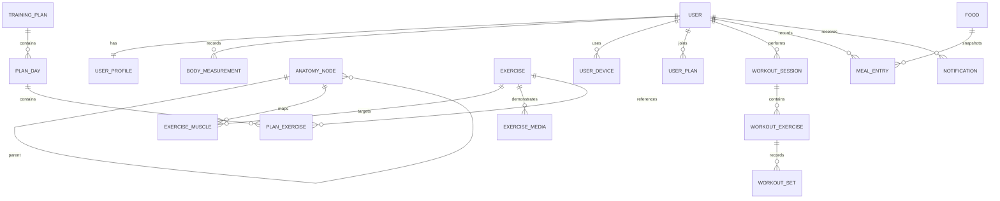

# YOU GYM 数据模型与 API 契约

版本：1.0  
更新日期：2026-08-14  
协议基线：REST JSON，前缀 `/api/v1`

## 1. 通用约定

- JSON 字段使用 `camelCase`，数据库字段使用 `snake_case`。
- ID 使用不暴露业务数量的 UUID/ULID 字符串；客户端不得推断或自增 ID。
- 时间使用 ISO 8601 UTC，例如 `2026-08-14T08:30:00Z`；自然日另用 `YYYY-MM-DD` 并携带用户时区。
- 重量内部单位 kg，距离 m，时长秒，营养 g/mg/kcal；返回可带 `displayUnit`，但原始数值不混用单位。
- 删除默认软删除；训练和饮食历史需要保留快照。
- 所有写请求支持或要求 `Idempotency-Key`，尤其是验证码发送、训练结束、训练组和饮食记录。
- 乐观并发使用 `version` 字段或 `If-Match`，冲突返回 `409`。

## 2. 统一响应

成功：

```json
{
  "data": {},
  "meta": {
    "requestId": "01J5...",
    "serverTime": "2026-08-14T08:30:00Z"
  }
}
```

失败：

```json
{
  "error": {
    "code": "AUTH_SMS_CODE_EXPIRED",
    "message": "验证码已过期，请重新获取",
    "fieldErrors": [],
    "retryable": true
  },
  "meta": {
    "requestId": "01J5..."
  }
}
```

错误 `message` 可直接展示但不包含内部异常、供应商名称或敏感信息。客户端根据 `code` 决定跳转和恢复，不解析文案。

## 3. 分页、筛选和排序

列表默认游标分页：

```json
{
  "data": {"items": []},
  "meta": {
    "nextCursor": "opaque-token",
    "hasMore": false,
    "requestId": "01J5..."
  }
}
```

查询参数：`cursor`、`limit`（默认 20，最大 100）、`sort`、业务筛选。游标不可被客户端解析。管理后台可对部分列表使用 `page/pageSize`，但移动端保持游标模式。

## 4. 核心实体关系



## 5. 用户与认证数据

### 5.1 `user`

| 字段 | 类型 | 说明 |
| --- | --- | --- |
| `id` | char(26/36) | 主键 |
| `phoneCountryCode` | varchar | 默认 `+86` |
| `phoneEncrypted` | varbinary | 加密存储 |
| `phoneHash` | char | 唯一检索哈希 |
| `status` | enum | ACTIVE、LOCKED、DELETE_PENDING、DELETED |
| `registeredAt` | datetime | 注册时间 |
| `lastLoginAt` | datetime | 最后登录 |
| `deleteScheduledAt` | datetime? | 删除生效时间 |

### 5.2 `user_profile`

昵称、头像、性别选择、出生年份、身高、当前体重、目标、经验、每周频率、单次时长、场地、器械、单位偏好、时区、语言、资料版本。

### 5.3 `body_measurement`

`measuredDate`、`weightKg`、可选 `bodyFatPercent`、腰围等扩展 JSON、来源（MANUAL/DEVICE/IMPORT）、备注和版本。任何趋势使用该历史表，不直接读取 `user_profile.currentWeight`。

### 5.4 认证接口

| 方法 | 路径 | 说明 |
| --- | --- | --- |
| POST | `/auth/sms/send` | 发送登录/注册验证码 |
| POST | `/auth/sms/login` | 校验并登录/注册 |
| POST | `/auth/refresh` | token 轮换 |
| POST | `/auth/logout` | 注销当前设备 |
| GET | `/me/devices` | 查看登录设备 |
| DELETE | `/me/devices/{deviceId}` | 退出指定设备 |

发送验证码请求：

```json
{
  "countryCode": "+86",
  "phone": "13800000000",
  "purpose": "LOGIN",
  "challengeToken": "optional-risk-token"
}
```

响应不返回验证码或账号存在状态，只返回 `cooldownSeconds` 和脱敏目标。

## 6. 解剖与动作模型

### 6.1 `anatomy_node`

| 字段 | 说明 |
| --- | --- |
| `id` | 稳定业务 ID，例如 `muscle.deltoid.anterior.left` |
| `parentId` | 上级区域/肌群/肌肉 |
| `level` | REGION、GROUP、MUSCLE、DIVISION、STRUCTURE |
| `nameZh` / `nameEn` / `latinName` | 多语言名称 |
| `side` | NONE、LEFT、RIGHT、BILATERAL |
| `selectableForTraining` | 是否进入动作筛选 |
| `visibleInModel` | 是否可显示 |
| `structureType` | MUSCLE、TENDON、LIGAMENT、ORIGIN、INSERTION、BONE_LANDMARK |
| `cameraPresetId` | 默认聚焦镜头 |
| `modelObjectKeys` | 男女模型对象 key 数组 |
| `status` / `version` | 发布状态和版本 |

### 6.2 `exercise`

核心字段：稳定 ID、名称/别名、动作模式、器械、场地、难度、冲击等级、单侧模式、步骤、呼吸、节奏、常见错误、安全提示、停止条件、参数范围、升级/降级动作、审核状态和版本。

`exercise_muscle`：`exerciseId`、`anatomyNodeId`、角色（PRIMARY/SECONDARY/STABILIZER）、参与度等级（HIGH/MEDIUM/LOW）、审核依据、排序。

`exercise_media`：类型、URL key、封面、宽高、时长、视角、语言、版权/AI 来源、审核状态和 checksum。

动作实体应保留 `sourceProvider`、`sourceExerciseId`、`sourceCommit`、`sourceAttribution` 和 `mediaLicenseStatus`，以支持 GitHub 种子数据的可追溯导入和 Gym visual 媒体授权隔离。

### 6.3 解剖与动作接口

| 方法 | 路径 | 主要参数 |
| --- | --- | --- |
| GET | `/anatomy/regions` | `gender`、`modelVersion` |
| GET | `/anatomy/tree` | `regionId`、`includeDisplayOnly` |
| GET | `/anatomy/nodes/{nodeId}` | 节点详情 |
| GET | `/anatomy/nodes/{nodeId}/exercises` | 器械、场地、难度、模式、分页 |
| GET | `/exercises` | 全局动作筛选 |
| GET | `/exercises/{exerciseId}` | 详情和媒体 |
| GET | `/assets/manifests/{gender}/{layer}` | 模型资源清单 |

节点动作接口只接受 `selectableForTraining=true`；否则返回 `ANATOMY_NODE_NOT_TRAINABLE` 并建议上级可训练节点。

## 7. 训练计划数据

### 7.1 模板实体

- `training_plan`：名称、目标、人群、等级、周期、周频率、时长、场地、器械、封面、审核、版本。
- `plan_day`：周序、日序、主题、预计时长、主要肌肉、可跳过。
- `plan_exercise`：动作、分区（WARMUP/MAIN/COOLDOWN）、顺序、组数、次数/时长、重量模式、休息、RPE、节奏、替代组。

### 7.2 用户计划

`user_plan` 保存 `sourcePlanId`、`sourcePlanVersion`、开始日期、计划日历、状态（ACTIVE/PAUSED/COMPLETED/ARCHIVED）、个性化覆盖和进度。模板更新不自动改变进行中的用户实例。

### 7.3 接口

| 方法 | 路径 | 说明 |
| --- | --- | --- |
| GET | `/training/plans` | 计划库和推荐 |
| GET | `/training/plans/{planId}` | 计划详情 |
| POST | `/me/plans` | 加入或创建计划 |
| PATCH | `/me/plans/{userPlanId}` | 暂停、恢复、改日程 |
| GET | `/me/plans/active` | 当前计划 |
| GET | `/me/training/today` | 今日训练状态 |

## 8. 训练会话数据

### 8.1 状态

`CREATED`、`ACTIVE`、`RESTING`、`PAUSED`、`COMPLETED`、`ENDED_EARLY`、`ABANDONED`、`SYNC_PENDING`。非法状态迁移返回 `WORKOUT_INVALID_TRANSITION`。

### 8.2 实体

- `workout_session`：用户、计划实例、训练日、开始/结束、状态、总暂停、时区、备注、版本、客户端会话 ID。
- `workout_exercise`：动作快照、顺序、替换来源、目标参数、实际完成摘要。
- `workout_set`：组类型、重量、次数、时长、距离、RPE、左右侧、完成状态、实际休息、完成时间和备注。

动作名称、单位和目标参数在会话中保存快照。动作内容下线不破坏历史详情。

### 8.3 接口

| 方法 | 路径 | 说明 |
| --- | --- | --- |
| POST | `/workouts` | 创建会话 |
| GET | `/workouts/{id}` | 恢复会话 |
| PATCH | `/workouts/{id}` | 开始、暂停、继续、备注 |
| POST | `/workouts/{id}/sets` | 新增训练组 |
| PATCH | `/workouts/{id}/sets/{setId}` | 编辑/完成训练组 |
| POST | `/workouts/{id}/exercises/{itemId}/replace` | 替换动作 |
| POST | `/workouts/{id}/finish` | 正常或提前结束 |
| POST | `/workouts/{id}/abandon` | 明确放弃 |
| GET | `/workouts/history` | 历史分页 |
| GET | `/workouts/trends` | 聚合趋势 |

训练组写入请求包含 `clientUpdatedAt`、`version` 和 `clientMutationId`。服务端按 `clientMutationId` 去重。

## 9. 饮食数据

### 9.1 食品

`food` 保存内部 ID、provider、providerFoodId、名称、品牌、分类、常用份量、标准化营养、数据完整度、来源时间和状态。供应商原始响应按许可政策决定是否缓存，不能默认永久保存全部字段。

`food_serving` 保存单位、数值、克/毫升换算和营养数值。`custom_food` 仅属于创建用户。

### 9.2 餐次记录

`meal_entry` 保存用户、日期、时区、餐次、食品引用、食品名称快照、份量、营养快照、标签、备注、同步状态和版本。

### 9.3 接口

| 方法 | 路径 | 说明 |
| --- | --- | --- |
| GET | `/foods/search` | FatSecret + 本地搜索 |
| GET | `/foods/{foodId}` | 食品详情/份量 |
| GET | `/foods/recent` | 最近和常用 |
| POST | `/foods/custom` | 创建个人食品 |
| POST | `/meals` | 新增记录 |
| PUT | `/meals/{mealEntryId}` | 编辑记录 |
| DELETE | `/meals/{mealEntryId}` | 删除记录 |
| GET | `/nutrition/daily` | 当天汇总和餐次 |
| GET | `/nutrition/trends` | 周/月趋势 |
| GET/PUT | `/nutrition/targets` | 目标设置 |

食品搜索响应包含 `provider`、`stale`、`dataCompleteness` 和 `servingSummary`，客户端据此显示来源与缺失提示。

## 10. 通知、资源与设置

- `notification_preference`：类型、启用、时间、星期、渠道、免打扰。
- `notification`：类型、标题、摘要、深链、重要级别、已读、过期时间。
- `device_push_token`：设备、平台、provider、token 加密值、最后活跃和状态。
- `asset_manifest`：资源包、版本、依赖、大小、哈希、URL、最低 App 版本和状态。

接口：

```text
GET  /notifications
POST /notifications/{id}/read
POST /notifications/read-all
GET  /me/notification-preferences
PUT  /me/notification-preferences
POST /me/devices/push-token
GET  /assets/manifests
```

当前 App 用户通知接口已落地为 `/api/v1/me/notifications`：支持 `unreadOnly`、未读数、单条已读和全部已读；通知发送任务和后台编排仍按运营需求接入。

短信不是普通通知偏好中的可选渠道。

## 11. 管理后台 API

后台使用 `/api/admin/v1`，与移动端鉴权和权限分开。所有写操作记录操作者、来源 IP、变更前后摘要和理由。

主要资源：`/exercises`、`/anatomy/nodes`、`/anatomy/mappings`、`/plans`、`/foods/overrides`、`/media`、`/reviews`、`/releases`、`/notifications`、`/sms/logs`、`/audit-logs`、`/feature-flags`。

发布接口必须要求当前资源版本和审核状态，避免覆盖他人编辑。

## 12. 关键错误码

| HTTP | code | 含义 |
| ---: | --- | --- |
| 400 | `VALIDATION_FAILED` | 字段校验失败 |
| 401 | `AUTH_TOKEN_EXPIRED` | access token 过期 |
| 401 | `AUTH_SMS_CODE_INVALID` | 验证码错误 |
| 410 | `AUTH_SMS_CODE_EXPIRED` | 验证码过期 |
| 429 | `AUTH_SMS_RATE_LIMITED` | 短信频控 |
| 403 | `CONTENT_NOT_AUTHORIZED` | 无权访问内容 |
| 404 | `RESOURCE_NOT_FOUND` | 资源不存在/已下线 |
| 409 | `VERSION_CONFLICT` | 乐观锁冲突 |
| 409 | `WORKOUT_ACTIVE_EXISTS` | 已有未结束会话 |
| 422 | `ANATOMY_NODE_NOT_TRAINABLE` | 节点不可作筛选目标 |
| 422 | `WORKOUT_INVALID_TRANSITION` | 会话状态非法迁移 |
| 503 | `FOOD_PROVIDER_UNAVAILABLE` | 食品供应商暂不可用且无缓存 |
| 507 | `ASSET_STORAGE_INSUFFICIENT` | 客户端空间不足（客户端域） |

## 13. 数据保留与审计

- 验证码哈希到期后自动清理；发送日志仅保留脱敏目标和结果。
- 训练、饮食和身体数据按用户账号生命周期保存；删除账号后按政策删除或匿名化。
- 内容审核、发布和管理后台审计按合规要求保留，不包含不必要的健康数据。
- 分析事件使用匿名用户标识，禁止把手机号、自由文本备注和详细健康数据放入事件属性。

## 14. 契约验收

- OpenAPI 文档由服务端生成并在 CI 校验破坏性变更。
- 客户端使用契约测试覆盖核心成功/失败响应。
- 所有写接口有幂等、版本冲突或明确不需要它们的说明。
- 训练历史与饮食历史均使用快照，内容更新不改变既有记录。
- 管理后台与移动端 API 权限、token 和域名逻辑隔离。
